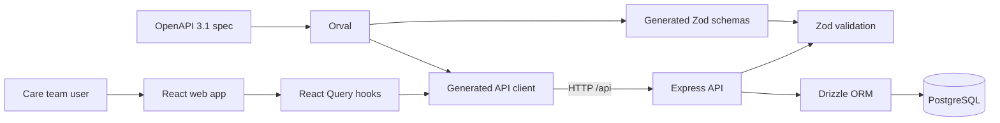

# Architecture

## System overview

## Web application

`artifacts/senior-companion` is a React 19 and Vite app. Wouter provides page routing, TanStack Query manages server state, and Tailwind CSS is used for styling. The app is Arabic-first and RTL.

The main routes are:

| Route | Screen |
| --- | --- |
| `/` | Dashboard |
| `/reminders` | Medication reminders |
| `/family` | Family contacts |
| `/alerts` | Alerts |
| `/devices` | Device records |
| `/profile` | Patient profile |
| `/reports` | Client-side summary and print view |

Page-level hooks wrap the generated API client and invalidate the relevant query cache after mutations. Reports are assembled in the browser from the existing profile, reminder, alert, device, and daily-log data; there is no separate reports endpoint.

## API and shared libraries

The Express 5 app mounts its routers under `/api`. Route handlers parse request bodies and validate returned data with generated Zod schemas. The OpenAPI 3.1 document in `lib/api-spec/openapi.yaml` drives both:

- React Query hooks and a fetch client in `lib/api-client-react`
- Zod schemas in `lib/api-zod`

The API server uses `lib/db` for its PostgreSQL connection and Drizzle schema. The database package reads `DATABASE_URL`.

## Request flow

1. A page invokes a hook from the web app.
2. The generated client sends an HTTP request to the `/api` base path.
3. Express dispatches the request to a route handler.
4. The handler validates inputs, reads or changes data through Drizzle, and returns JSON.
5. React Query updates or invalidates cached data so the page can refresh.

The mockup sandbox is a separate Vite app used to preview components. It is not part of the production data flow.